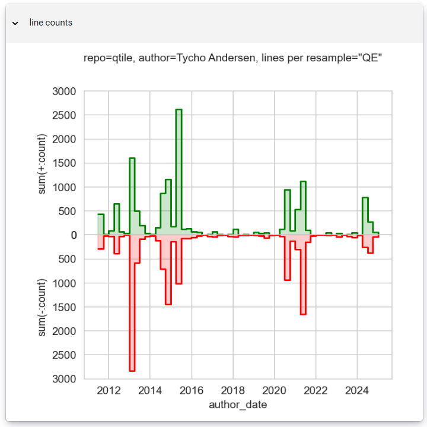
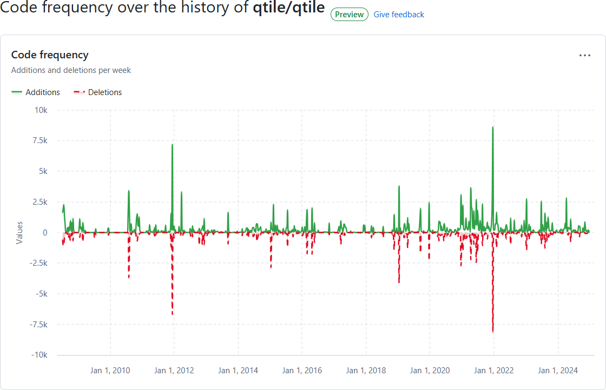
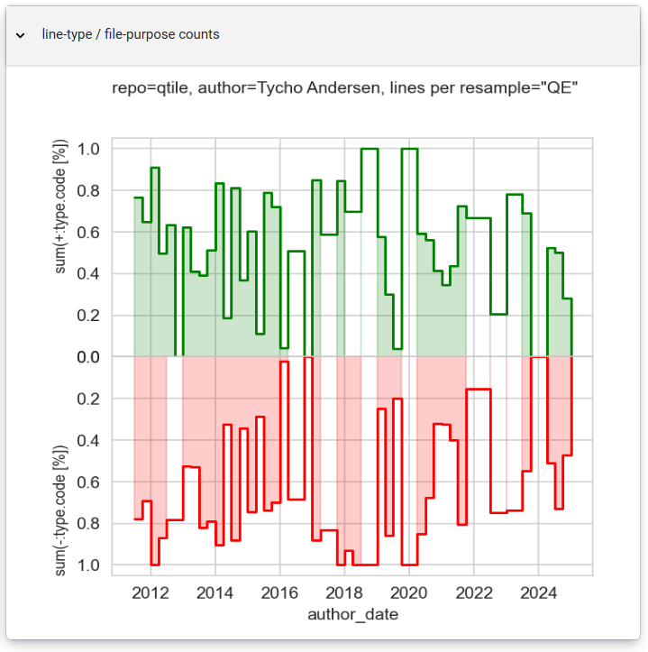

# Author Statistics

This dashboard shows various different plots
for selected author in selected repository in selected JSON data file.

It is somewhat similar to 
per-author part of the Contributors Graph part of GitHub Insights tab for a repository, 
or plots in the Overview tab for a given author / contributor on GitHub.

This dashboard app was created using HoloViz [Panel][] version 1.5.4.

## Running the app

You can run this app with `panel serve src/diffinsights_web/apps/author.py`
from the top directory of PatchScope sources.  You can get source code
from GitHub: <https://github.com/ncusi/PatchScope>.

The demo of this app is also available at
<https://patchscope-9d05e7f15fec.herokuapp.com/author>.

## Available plots

This app includes, as of PatchScope version **0.4.1**, the following plots:

- selected aggregation function (e.g. sum) over selected time period (e.g. weekly)
  of added ('+:count') and deleted ('-:count') lines in a commit, shown on one plot
- as above, but for selected line type (e.g. 'type.code'),
  or its overall contribution as ratio / percentage (e.g. 'type.code \[%]')
- contributions to patch size, namely added lines ('add'), deleted lines ('rem'),
  and how much of those were neighbouring changes and count as modified lines ('mod'),
  all on the same plot
- commit count over selected time period (e.g. week, making it weekly commit count)
- (bi)histogram of added ('+:count') and removed ('-:count') lines per commit
- (bi)histogram of added ('+:count') and removed ('-:count') lines per resample period
  (e.g. weekly)
- heatmap of types of contributions (line types) over date,
  separately for deleted lines (using Reds colormap)
  and added lines (using Greens colormap),
  as of **0.4.1** with fixed monthly frequency ('ME', <b>m</b>onth <b>e</b>nd)
- heatmap showing 2d distribution of total number of commits
  with marginal histograms, showing periodicity of contributions
  (uses author local time, assuming information about timezone was correct)

As of version **0.4.1** almost all plots are created using [Seaborn][] and/or
[Matplotlib][] libraries, and displayed using [Panel][]'s
[Matplotlib pane](https://panel.holoviz.org/reference/panes/Matplotlib.html),
with PNG or SVG rendering.
There are exceptions that use [hvPlot][] library (with some [HoloViews][] use),
with the [Bokeh][] backend.

Additionally, at the bottom of the main part of the page, after a horizontal
dividing line (a horizontal separator), there are a few informative panes,
as of **0.4.1** not yet grouped into single tabbed widget like in
[Contributors Graph app](contributors_graph.md):

- [Debugger widget](https://panel.holoviz.org/reference/widgets/Debugger.html)
  that shows show logs and errors from the running app
- [JSONEditor widget](https://panel.holoviz.org/reference/widgets/JSONEditor.html)
  in a 'view' mode, that shows the original JSON input data; you can search it
- [Tabulator widget](https://panel.holoviz.org/reference/widgets/Tabulator.html)
  that shows DataFrame with all the data extracted from JSON input file,
  and with the derived data; allows to sort and search each column
- [Perspective pane](https://panel.holoviz.org/reference/panes/Perspective.html)
  with data grouped / resampled over specified time period (e.g. 'W' for weekly)
  and aggregated with specified aggregation function (e.g. sum)

[Bokeh]: https://bokeh.org/
[HoloViews]: https://holoviews.org/
[hvPlot]: https://hvplot.holoviz.org/
[Matplotlib]: https://matplotlib.org/
[Panel]: https://panel.holoviz.org/
[Seaborn]: https://seaborn.pydata.org/

### Code frequency over time, for author

This plot shows, by default, the total number of added and deleted lines
over given period of time (weekly, semi-monthly, monthly, quarterly, etc.),
that is the sum of number of added and deleted lines in a commit over all commits
that were authored by given author in a given period of time.

Added lines are shown with <i>y</i>-axis pointing up, using green line color, while
deleted lines are shown with <i>y</i>-axis pointing down, using red line color.

Here is an example for qtile repository (from PatchScope version **0.4.1**):

It is step area plot; step function was selected to denote that it is aggregate
over given period of time - in the example above, over quarter (QE - quarter end).

Here is the same plot, but with smaller resample period, monthly (ME - month end):

And here is with even smaller resample period, weekly (W - week):

This plot is very similar to the Code Frequency plot in GitHub Insights pane
for a repository, but the GitHub Code Frequency plot is for the whole repository,
not for selected author, and the resample frequency is fixed: weekly.

Here is an example for qtile repo from
<https://github.com/qtile/qtile/graphs/code-frequency>:

This plot uses solid green line for additions, and dashed red line for deletions.
It literally uses negative values for deletions, instead of inverting
the y-axis.  It is an interactive plot - you can get exact values on hover.

### Line type frequency over time, for author

The next plot is the 'line type / file purpose counts' plot
(though as of version **0.4.1**, only line type are turned on and available).
This uses the same type of plot as the previous one,
that its it shows contributions from added and deleted lines on the same plot,
with contribution from deleted lines shown on reversed y-axis.

The difference is where the data to plot comes from.  Instead of considering
each changed line, as in the case of the previous plot, you can select
what kind of lines you want to count.  The line types present in the
input data depend on the configuration of the annotation process (`diff-annotate`),
and  optionally on the configuration of the post-processing step (`diff-gather-stats`).

What counts as line of specific type also depends on the configuration of the
annotation process.  For `*.timeline.purpose-to-type.json` data files, the following
rules were applied (see also similar description in [Contributors Graph](contributors_graph.md)
documentation):

- if the changed file purpose (the changed line belong to) was either
  of "data", "documentation", "markup", "other", "project", or "test",
  then the line counts as that type,
- if line consists only of whitespace and comments, or is inside docstring,
  it counts as "documentation",
- otherwise it counts as "code".

This is not the only possible configuration.  For example, you might want
comments in "test" files to count as "documentation", and only lines with
some code count as "test".  This can be done with a line callback.

The following "columns" (line types) are available for the example data
files, as of PatchScope **0.4.1**:

- type.code
- type.documentation
- type.test
- type.data
- type.markup
- type.project
- type.other

GitHub Linguist uses the following categorization for _language_ types
(those are for the file as a whole; depending on configuration of the
annotation process, every changed line can be labelled as having that
type):

- data (for example: `*.afm`, `CODEOWNERS`, `*.csv`, `*.json`, `*.diff`,
  but it also includes some project files, like Pip Requirements: `requirements.txt`;
  "project" files are specified in PatchScope with custom rules), 
- programming (for example: `*.asm`, `*.c`, `*.cpp`, `*.py`,
  but it includes also some project files, like `CMakeLists.txt` and `Makefile`),
- markup (for example: `*.css`, `*.html`, `*.jinja`, `*.ipynb`, `*.tex`), 
- prose (for example: `*.po` (gettext), `*.md` (Markdown), `*.txt` (plain text)), 
- nil

Here is an example of the plot for 'type.data' changed lines (added and deleted
lines, plotted separately but on the same plot), the quarterly ('QE') count
('sum' as aggregation function), for selected author in selected repository:

This plot is from PatchScope version **0.4.1**.

For each line type (like 'type.code', for example) there is also corresponding
line type percentage equivalent (like 'type.code \[%]', for example).
This percentage is computed as the number of added ('+') or deleted ('-')
lines of given type (kind), over total number of added or deleted lines.

Here is an example of the plot for 'type.code \[%]' (from version **0.4.1**
of PatchScope):

The figure above shows that for this author, in this specific repository,
changes to code dominate.  Note that cases where both percentages are zero
('+:type.code' and '-:type.code') means that for given period of time there
were no commits contributed by the selected author.
